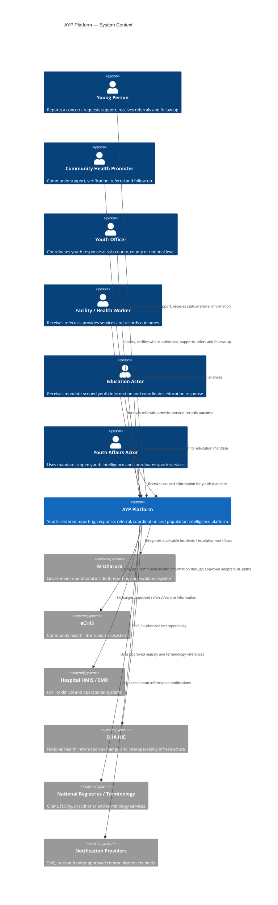
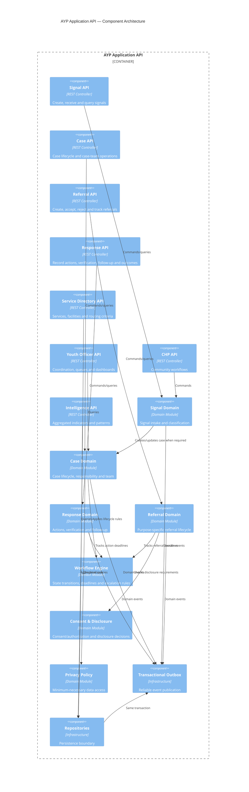
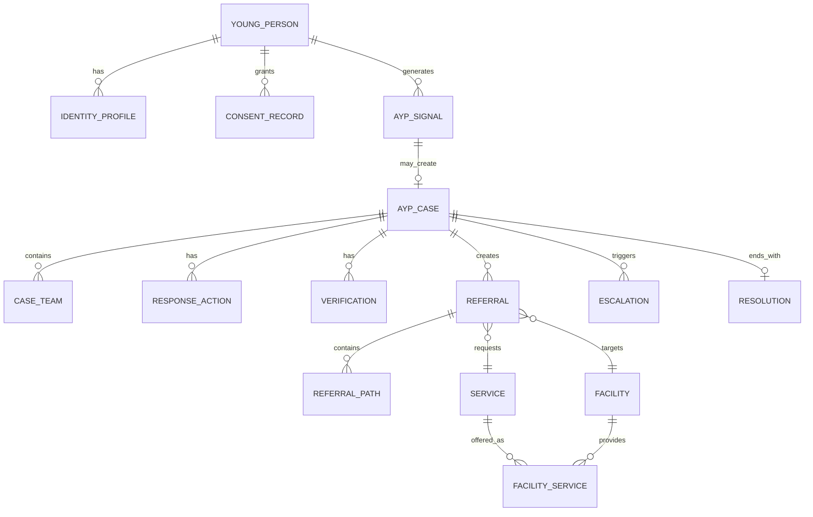
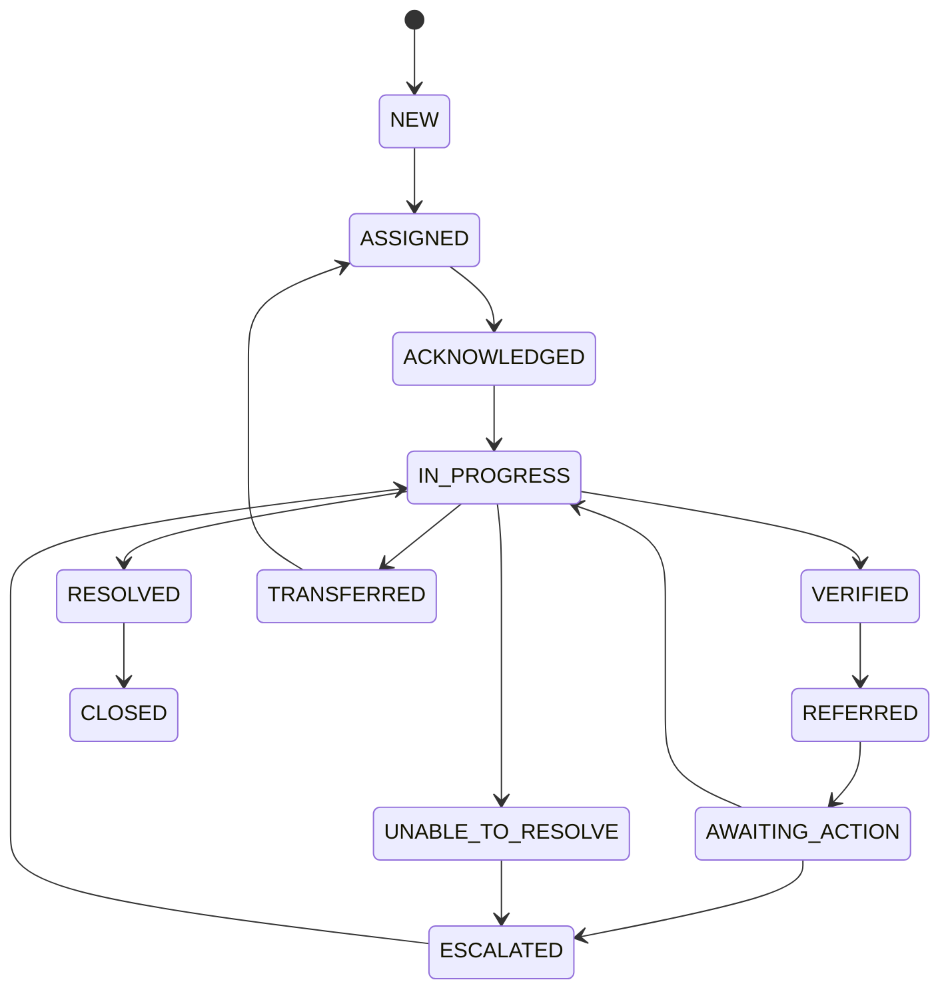

# AYP Platform — C4 Architecture, Domain Model, API & Event Specification

**Status:** Architecture continuation  
**Technology baseline:** Java + Spring Boot, PostgreSQL, Redis, event broker, REST/OpenAPI, FHIR R4  
**Interoperability baseline:** Kenya Core FHIR + DHA HIE  
**AI/ML:** None  
**Primary architecture style:** Modular monolith first; event-driven boundaries; extract services only when justified

---

## 1. Architecture Position

The AYP platform is a privacy-preserving response and intelligence layer for adolescents and young people. It is not a replacement for M-Dharura, eCHIS, hospital HMIS, or the national DHA interoperability layer.

The internal application uses AYP domain concepts and maps them to external standards only at integration boundaries.

The national interoperability boundary should align with Kenya Core FHIR. The current published Kenya Core IG is active at version 1.0.0 and uses FHIR R4; it defines reusable profiles, terminology, identifiers, security/provenance conventions and domain-IG composition. The DHA public FHIR server is based on HAPI FHIR. These facts should be revalidated during production onboarding because implementation guides and integration requirements can change.

---

# 2. C4 Architecture

## 2.1 C4 Level 1 — System Context



### Context boundary

The AYP Platform owns:

- AYP signals
- AYP cases
- case teams
- workflow and assignment
- referral coordination
- escalation workflow
- service-gap intelligence
- response-bottleneck intelligence
- privacy and access decisions for AYP data
- audit records
- AYP-specific interoperability mappings

The platform does **not** own:

- national client identity as a competing registry
- national facility registry
- national terminology authority
- hospital clinical record as a replacement HMIS
- M-Dharura's operational mandate
- government policy decisions

---

# 3. C4 Level 2 — Container Diagram

```mermaid
C4Container
title AYP Platform — Container Architecture

Person(youngPerson, "Young Person")
Person(chp, "CHP")
Person(youthOfficer, "Youth Officer")
Person(facilityStaff, "Facility Staff")
Person(educationActor, "Education Actor")
Person(youthActor, "Youth Affairs Actor")

System_Boundary(ayp, "AYP Platform") {

  Container(web, "Web / Admin Portal", "Web application", "Role-specific dashboards and case/referral workflows")

  Container(mobile, "Mobile / Low-Connectivity Client", "Mobile/PWA", "Youth and CHP workflows with offline queue where required")

  Container(api, "AYP Application API", "Java + Spring Boot", "REST APIs, authorization, workflow commands and queries")

  Container(modules, "AYP Domain Modules", "Spring Boot modular monolith", "Signal, case, team, referral, service, escalation, consent, notification and resolution domains")

  Container(authz, "Authorization & Privacy Engine", "Spring Security + policy layer", "RBAC + ABAC + relationship/geographic access decisions")

  ContainerDb(coreDb, "Operational Database", "PostgreSQL", "Transactional AYP data")

  Container(cache, "Cache", "Redis", "Short-lived cache, rate limiting and workflow acceleration; not source of truth")

  Container(broker, "Event Broker", "Kafka or RabbitMQ", "Durable domain/integration events")

  Container(worker, "Async Worker", "Spring Boot", "Notifications, retries, integration jobs, escalation timers and reconciliation")

  Container(integration, "Interoperability Layer", "Spring Boot + HAPI FHIR", "FHIR mapping, validation, adapter orchestration and external exchange")

  Container(analytics, "Analytics Pipeline", "Events + SQL/statistical processing", "Aggregations, service-gap and response-bottleneck detection")

  ContainerDb(analyticsDb, "Analytics Store", "PostgreSQL/warehouse", "Aggregated and de-identified analytical data")

  Container(audit, "Audit & Security Log", "Append-only store", "Sensitive access and administrative audit events")
}

System_Ext(dha, "DHA HIE")
System_Ext(echis, "eCHIS")
System_Ext(hmis, "HMIS / EMR")
System_Ext(mdharura, "M-Dharura")
System_Ext(registry, "National Registries / Terminology")
System_Ext(notify, "Notification Providers")

Rel(youngPerson, mobile, "Uses")
Rel(chp, mobile, "Uses")
Rel(youthOfficer, web, "Uses")
Rel(facilityStaff, web, "Uses")
Rel(educationActor, web, "Uses")
Rel(youthActor, web, "Uses")

Rel(web, api, "HTTPS/JSON")
Rel(mobile, api, "HTTPS/JSON; sync")
Rel(api, authz, "Authorize every protected operation")
Rel(api, modules, "Commands/queries")
Rel(modules, coreDb, "Read/write")
Rel(modules, cache, "Cache")
Rel(modules, broker, "Publish/consume")
Rel(worker, broker, "Consume")
Rel(worker, coreDb, "Update workflow state")
Rel(integration, broker, "Publish/consume integration events")
Rel(integration, dha, "FHIR/approved DHA interfaces")
Rel(integration, echis, "Approved adapter")
Rel(integration, hmis, "Approved adapter")
Rel(integration, mdharura, "Approved adapter")
Rel(integration, registry, "Registry/terminology lookup")
Rel(worker, notify, "Minimum-information notifications")
Rel(broker, analytics, "Domain events")
Rel(analytics, analyticsDb, "Aggregated writes")
Rel(api, audit, "Security/access audit")
```



---

# 4. C4 Level 3 — AYP Application Components



---

# 5. C4 Level 4 — Key Code-Level Structure

Recommended Spring Boot package structure:

```text
ke.go.ke.ayp
├── AypApplication.java
│
├── shared
│   ├── domain
│   ├── security
│   ├── errors
│   ├── events
│   ├── audit
│   └── pagination
│
├── signal
│   ├── api
│   ├── application
│   ├── domain
│   └── infrastructure
│
├── case_management
│   ├── api
│   ├── application
│   ├── domain
│   └── infrastructure
│
├── case_team
├── response
├── referral
├── service_directory
├── chp
├── youth_officer
├── consent
├── safeguarding
├── workflow
├── escalation
├── notification
├── resolution
├── analytics
├── interoperability
│   ├── fhir
│   ├── dha
│   ├── echis
│   ├── hmis
│   └── mdharura
│
└── audit
```

The module boundaries are logical boundaries first. They do not need to become separate deployable microservices in the first implementation.

---

# 6. Domain Model

## 6.1 Core aggregate map

```text
YoungPerson
    │
    ├── IdentityProfile
    ├── ContactPoint
    └── ConsentRecord(s)
            │
            ▼
        AYPSignal
            │
            ├── SignalSource
            ├── SignalClassification
            ├── SignalLocation
            └── SignalEvidence
                    │
                    ▼
                 AYPCase
                    │
                    ├── CaseTeam
                    │      ├── CHP
                    │      ├── YouthOfficer
                    │      └── FacilityActor
                    │
                    ├── ResponseAction(s)
                    ├── Verification
                    ├── Referral(s)
                    │      └── ReferralPath
                    │
                    ├── Escalation(s)
                    ├── FollowUp(s)
                    └── Resolution
                           │
                           ▼
                    Population Intelligence
                    Service Gap
                    Response Bottleneck
```

---

# 7. Core Entities

## 7.1 YoungPerson

Purpose: represent the person receiving or requesting AYP support.

Key fields:

```text
id: UUID
external_client_ref: String?       # national/DHA reference where authorized
date_of_birth: Date?
age_band: Enum
sex: Code?
preferred_language: Code?
contact_status: Enum
vulnerability_flags: controlled/non-free-text flags
created_at: Instant
updated_at: Instant
```

Important rule:

> Identity data must not be copied into analytics tables unless explicitly required.

---

## 7.2 IdentityProfile

```text
id: UUID
young_person_id: UUID
full_name: encrypted
phone: encrypted
email: encrypted?
national_identifier_ref: protected reference?
preferred_contact_channel: Enum
verification_status: Enum
created_at
updated_at
```

Identity is logically separated from operational case data.

---

## 7.3 AYPSignal

A signal is an observed/requested need. It is not automatically a case.

```text
id: UUID
signal_ref: String
young_person_id: UUID?
source_type: Enum
source_actor_id: UUID?
signal_type: Code
need_category: Code
severity: Enum
urgency: Enum
description: protected text
location_ref: UUID?
reported_at: Instant
consent_status: Enum
safeguarding_status: Enum
case_conversion_status: Enum
created_at
```

Examples:

```text
YOUNG_PERSON
CHP
FACILITY
YOUTH_OFFICER
EDUCATION
SYSTEM
```

---

## 7.4 AYPCase

The case is the operational response container.

```text
id: UUID
case_ref: String
primary_young_person_id: UUID
origin_signal_id: UUID
case_type: Code
priority: Enum
status: Enum
current_responsible_actor_id: UUID?
current_responsible_org_id: UUID?
sub_county_ref: UUID?
county_ref: UUID?
opened_at: Instant
due_at: Instant?
closed_at: Instant?
closure_reason: Code?
version: Long
created_at
updated_at
```

### Case statuses

```text
NEW
ASSIGNED
ACKNOWLEDGED
IN_PROGRESS
VERIFIED
REFERRED
AWAITING_ACTION
ESCALATED
TRANSFERRED
RESOLVED
CLOSED
UNABLE_TO_RESOLVE
```

---

# 8. CaseTeam

A case team is an explicit access boundary.

```text
id: UUID
case_id: UUID
actor_id: UUID
actor_type: Enum
organization_id: UUID
role_on_case: Enum
scope: Enum
access_from: Instant
access_until: Instant?
status: Enum
created_at
```

Possible roles:

```text
CASE_OWNER
CHP_SUPPORT
CHP_VERIFIER
YOUTH_OFFICER_COORDINATOR
FACILITY_RESPONDER
REFERRAL_COORDINATOR
SUPERVISOR
SAFEGUARDING_RESPONDER
```

A user having a general government role must not automatically grant access to every case.

---

# 9. ResponseAction

```text
id: UUID
case_id: UUID
actor_id: UUID
action_type: Code
action_status: Enum
started_at: Instant?
completed_at: Instant?
notes: protected text
outcome_code: Code?
created_at
```

Examples:

```text
CONTACTED
ASSESSED
VERIFIED
PROVIDED_SUPPORT
REFERRED
FOLLOWED_UP
COORDINATED
REFERRED_TO_SUPERVISOR
```

---

# 10. Referral

A referral is a purpose-specific data-sharing and service-routing object.

```text
id: UUID
case_id: UUID
source_actor_id: UUID
source_org_id: UUID
destination_org_id: UUID
destination_service_id: UUID
reason_code: Code
priority: Enum
required_information_profile: Code
consent_status: Enum
status: Enum
created_at: Instant
accepted_at: Instant?
completed_at: Instant?
rejected_at: Instant?
rejection_reason: Code?
```

### Referral statuses

```text
DRAFT
PENDING_AUTHORIZATION
SENT
RECEIVED
ACCEPTED
REJECTED
IN_PROGRESS
COMPLETED
CANCELLED
EXPIRED
```

---

# 11. ReferralPath

Used when a referral requires multiple routing steps.

```text
id: UUID
referral_id: UUID
sequence_no: Integer
organization_id: UUID
service_id: UUID
routing_reason: Code
status: Enum
created_at
```

Example:

```text
CHP
  ↓
Nearby facility
  ↓
Specialized facility
  ↓
Follow-up service
```

The young person's entire case should not be replicated at every destination.

---

# 12. ServiceDirectory

```text
Service
-------
id
code
name
category
eligibility_rules
active

Facility
--------
id
external_facility_ref
name
county_ref
sub_county_ref
location
active

FacilityService
---------------
facility_id
service_id
availability_status
hours
eligibility
referral_required
last_verified_at
```

Routing is deterministic:

```text
need
→ required service
→ eligible facilities
→ geography
→ availability
→ referral policy
→ selected destination
```

No AI/ML is required.

---

# 13. Verification

```text
id: UUID
case_id: UUID
verifier_id: UUID
verification_type: Code
result: Enum
evidence_ref: UUID?
notes: protected text
verified_at: Instant
```

Results:

```text
CONFIRMED
NOT_CONFIRMED
PARTIALLY_CONFIRMED
UNABLE_TO_VERIFY
```

---

# 14. Escalation

```text
id: UUID
case_id: UUID
from_actor_id: UUID
to_actor_id: UUID
from_scope: Enum
to_scope: Enum
reason_code: Code
trigger_type: Enum
deadline: Instant?
status: Enum
created_at
resolved_at: Instant?
```

Trigger examples:

```text
DEADLINE_MISSED
HIGH_PRIORITY
SAFEGUARDING
SUPERVISOR_REQUEST
MANUAL_ESCALATION
SYSTEM_RETRY_EXHAUSTED
```

---

# 15. Resolution

```text
id: UUID
case_id: UUID
resolution_code: Code
outcome_code: Code
resolved_by: UUID
resolved_at: Instant
young_person_followup_required: Boolean
followup_due_at: Instant?
notes: protected text
```

---

# 16. Consent and Disclosure

## ConsentRecord

```text
id: UUID
young_person_id: UUID
case_id: UUID?
purpose_code: Code
data_scope_code: Code
recipient_scope_code: Code
decision: Enum
recorded_by: UUID
recorded_at: Instant
expires_at: Instant?
withdrawn_at: Instant?
```

Do not implement consent as a single boolean.

The authorization model must distinguish:

```text
purpose
+
data scope
+
recipient
+
legal/safeguarding basis
+
time
```

Emergency/safeguarding workflows may require authorized disclosure according to applicable policy and law.

---

# 17. AuditEvent

Audit is separate from ordinary domain events.

```text
id: UUID
event_id: UUID
actor_id: UUID?
actor_role: Code?
organization_id: UUID?
action: Code
resource_type: Code
resource_id: UUID?
decision: Code
reason_code: Code?
timestamp: Instant
ip_hash: String?
device_ref: String?
correlation_id: UUID
```

Examples:

```text
CASE_VIEWED
IDENTITY_VIEWED
CASE_TEAM_ADDED
REFERRAL_CREATED
REFERRAL_DATA_EXPORTED
CONSENT_CHANGED
ROLE_CHANGED
ACCESS_DENIED
ESCALATION_CREATED
```

---

# 18. Domain Relationships



---

# 19. PostgreSQL Logical Schema

Recommended schema separation:

```text
ayp_identity
ayp_case
ayp_referral
ayp_service
ayp_workflow
ayp_consent
ayp_audit
ayp_analytics
ayp_integration
```

Example tables:

```text
ayp_identity.young_person
ayp_identity.identity_profile
ayp_identity.contact_point

ayp_case.signal
ayp_case.case
ayp_case.case_team
ayp_case.response_action
ayp_case.verification
ayp_case.follow_up
ayp_case.resolution

ayp_referral.referral
ayp_referral.referral_path
ayp_referral.referral_event

ayp_service.service
ayp_service.facility
ayp_service.facility_service
ayp_service.service_availability

ayp_workflow.workflow_definition
ayp_workflow.workflow_instance
ayp_workflow.deadline
ayp_workflow.escalation

ayp_consent.consent
ayp_consent.disclosure_decision

ayp_audit.audit_event
ayp_audit.access_event

ayp_integration.outbox_event
ayp_integration.inbox_event
ayp_integration.external_reference
ayp_integration.integration_failure
```

---

# 20. Database Rules

## Required constraints

1. UUID primary keys for internal identifiers.
2. Human-readable references are separate, e.g. `CASE-2026-00001234`.
3. Foreign keys must enforce relationship integrity.
4. `created_at` and `updated_at` on mutable entities.
5. Optimistic locking using `version`.
6. Soft deletion only where operationally justified.
7. Sensitive fields encrypted at application/database layer as appropriate.
8. No identity data in analytical fact tables.
9. Every external identifier has an `external_reference` record.
10. Every integration request has a correlation ID.
11. Every consumed event has an idempotency key.
12. Every event has a schema version.

---

# 21. Indexing Strategy

Important indexes:

```sql
-- Case queues
CREATE INDEX idx_case_responsible_status
ON ayp_case.case(current_responsible_actor_id, status);

-- Geographic operational queues
CREATE INDEX idx_case_geo_status
ON ayp_case.case(county_ref, sub_county_ref, status);

-- Referral tracking
CREATE INDEX idx_referral_destination_status
ON ayp_referral.referral(destination_org_id, status);

-- Deadline processing
CREATE INDEX idx_deadline_due_status
ON ayp_workflow.deadline(due_at, status);

-- Case history
CREATE INDEX idx_response_case_time
ON ayp_case.response_action(case_id, created_at);

-- Event processing
CREATE UNIQUE INDEX uq_outbox_event
ON ayp_integration.outbox_event(event_id);

-- Idempotent inbound processing
CREATE UNIQUE INDEX uq_inbox_event
ON ayp_integration.inbox_event(source_system, source_event_id);
```

Do not add indexes simply because a field exists. Indexes should follow actual query patterns.

---

# 22. API Design

Base URL:

```text
/api/v1
```

External interoperability:

```text
/integration/v1
```

FHIR boundary:

```text
/fhir
```

Admin/operations:

```text
/api/v1/admin
```

---

# 23. Authentication

Use OAuth 2.0 / OpenID Connect compatible identity infrastructure where available.

Access token claims should identify:

```json
{
  "sub": "actor-uuid",
  "roles": ["CHP"],
  "organization_id": "org-uuid",
  "county_id": "county-uuid",
  "sub_county_id": "subcounty-uuid"
}
```

Do not accept organization/geographic scope blindly from request bodies.

The server derives authorization scope from the authenticated identity and authoritative organizational relationships.

---

# 24. Authorization Model

Final decision:

```text
Role
+
Organization
+
Geographic scope
+
Case relationship
+
Purpose
+
Data classification
+
Requested action
=
Authorization decision
```

Example:

```text
CHP
+ assigned case
+ same operational area
+ case-team member
+ support purpose
+ case data
+ READ
= ALLOW
```

But:

```text
CHP
+ same area
+ not assigned
+ identity data
+ READ
= DENY
```

---

# 25. REST API Specification

## 25.1 Signals

### Create signal

```http
POST /api/v1/signals
```

Request:

```json
{
  "sourceType": "YOUNG_PERSON",
  "signalType": "HEALTH_SUPPORT_REQUEST",
  "needCategory": "MENTAL_WELLBEING",
  "urgency": "NORMAL",
  "location": {
    "countyCode": "KE-047",
    "subCountyCode": "..."
  },
  "description": "Protected signal description",
  "consent": {
    "purpose": "SUPPORT_AND_REFERRAL",
    "decision": "GRANTED"
  }
}
```

Response:

```json
{
  "signalId": "9b2...",
  "signalRef": "SIG-2026-00001982",
  "status": "RECEIVED",
  "caseCreated": false
}
```

---

## 25.2 Convert signal to case

```http
POST /api/v1/signals/{signalId}/convert-to-case
```

Request:

```json
{
  "caseType": "AYP_SUPPORT",
  "priority": "NORMAL",
  "reason": "Requires coordinated response"
}
```

Response:

```json
{
  "caseId": "3d7...",
  "caseRef": "CASE-2026-00000421",
  "status": "NEW"
}
```

---

# 26. Case API

### Get case

```http
GET /api/v1/cases/{caseId}
```

Returned representation must be role-scoped.

A CHP should not receive fields that only a supervisor, clinician or safeguarding actor is authorized to see.

### Assign case

```http
POST /api/v1/cases/{caseId}/assignment
```

```json
{
  "actorId": "actor-uuid",
  "roleOnCase": "CASE_OWNER",
  "reason": "Sub-county allocation"
}
```

### Acknowledge

```http
POST /api/v1/cases/{caseId}/acknowledge
```

### Record action

```http
POST /api/v1/cases/{caseId}/actions
```

```json
{
  "actionType": "FOLLOWED_UP",
  "outcomeCode": "CONTACT_SUCCESSFUL",
  "notes": "Protected operational note"
}
```

### Resolve

```http
POST /api/v1/cases/{caseId}/resolution
```

```json
{
  "resolutionCode": "SERVICE_PROVIDED",
  "outcomeCode": "RESOLVED",
  "followupRequired": true
}
```

---

# 27. Case Team API

### Add team member

```http
POST /api/v1/cases/{caseId}/team
```

```json
{
  "actorId": "actor-uuid",
  "roleOnCase": "CHP_SUPPORT",
  "scope": "CASE_DATA"
}
```

### Remove team member

```http
DELETE /api/v1/cases/{caseId}/team/{actorId}
```

Every change is audited.

---

# 28. Referral API

### Create referral

```http
POST /api/v1/cases/{caseId}/referrals
```

```json
{
  "serviceCode": "AYP_COUNSELLING",
  "destinationFacilityId": "facility-uuid",
  "reasonCode": "SERVICE_REQUIRED",
  "priority": "NORMAL",
  "informationProfile": "MINIMUM_REFERRAL",
  "consentReference": "consent-uuid"
}
```

### Receive referral

```http
POST /api/v1/referrals/{referralId}/receive
```

### Accept referral

```http
POST /api/v1/referrals/{referralId}/accept
```

### Reject referral

```http
POST /api/v1/referrals/{referralId}/reject
```

```json
{
  "reasonCode": "SERVICE_UNAVAILABLE",
  "alternativeSuggested": true
}
```

### Complete referral

```http
POST /api/v1/referrals/{referralId}/complete
```

```json
{
  "outcomeCode": "SERVICE_RECEIVED",
  "followUpRequired": true
}
```

---

# 29. Service Routing API

### Search services

```http
GET /api/v1/services?needCategory=MENTAL_WELLBEING
```

### Find facilities

```http
GET /api/v1/facilities?
    serviceCode=AYP_COUNSELLING&
    countyCode=KE-047&
    subCountyCode=...&
    available=true
```

### Recommend route

```http
POST /api/v1/referral-routing/evaluate
```

```json
{
  "needCategory": "MENTAL_WELLBEING",
  "serviceCode": "AYP_COUNSELLING",
  "countyCode": "KE-047",
  "subCountyCode": "..."
}
```

The result should expose **why** a facility was selected:

```json
{
  "facilityId": "facility-123",
  "routingReasons": [
    "SERVICE_AVAILABLE",
    "WITHIN_OPERATIONAL_AREA",
    "ELIGIBLE_PROVIDER"
  ]
}
```

This makes routing explainable without AI.

---

# 30. Youth Officer APIs

```http
GET /api/v1/officer/queue
GET /api/v1/officer/cases/unresolved
GET /api/v1/officer/cases/escalated
GET /api/v1/officer/referrals/pending
GET /api/v1/officer/service-gaps
GET /api/v1/officer/response-bottlenecks
GET /api/v1/officer/population-signals
```

Returned data is aggregated according to the officer's scope.

---

# 31. CHP APIs

```http
POST /api/v1/chp/signals
GET  /api/v1/chp/my-cases
GET  /api/v1/chp/my-referrals
POST /api/v1/chp/cases/{caseId}/verify
POST /api/v1/chp/cases/{caseId}/follow-up
```

The CHP experience should prioritize:

```text
My assigned work
→ What needs action
→ What is overdue
→ What was referred
→ What needs follow-up
```

---

# 32. Intelligence APIs

Intelligence endpoints must not return identifiable records unless the caller is explicitly authorized for operational investigation.

Examples:

```http
GET /api/v1/intelligence/issues
GET /api/v1/intelligence/service-demand
GET /api/v1/intelligence/referral-completion
GET /api/v1/intelligence/service-gaps
GET /api/v1/intelligence/response-bottlenecks
GET /api/v1/intelligence/trends
```

Example response:

```json
{
  "period": "2026-09",
  "geography": {
    "county": "KE-047"
  },
  "issueCategory": "AYP_HEALTH_SUPPORT",
  "signalCount": 143,
  "referralCount": 91,
  "completedReferralCount": 73,
  "medianResponseHours": 11.4
}
```

Apply minimum-cell thresholds before displaying small population groups to reduce re-identification risk.

---

# 33. API Error Contract

All APIs should use a consistent error structure:

```json
{
  "code": "CASE_ACCESS_DENIED",
  "message": "The requested operation is not permitted.",
  "correlationId": "corr-123",
  "timestamp": "2026-09-17T10:15:00Z"
}
```

Do not expose internal exception messages, SQL details or sensitive case information.

---

# 34. Event Architecture

Use domain events for internal integration and asynchronous processing.

Event naming:

```text
ayp.signal.reported.v1
ayp.case.created.v1
ayp.case.assigned.v1
ayp.case.acknowledged.v1
ayp.response.recorded.v1
ayp.case.verified.v1
ayp.referral.created.v1
ayp.referral.received.v1
ayp.referral.accepted.v1
ayp.referral.completed.v1
ayp.case.escalated.v1
ayp.case.resolved.v1
ayp.case.closed.v1
ayp.service_gap.detected.v1
ayp.response_bottleneck.detected.v1
```

Events describe facts that happened.

Commands describe requested actions.

Do not use events as disguised commands.

---

# 35. Event Envelope

Every event uses a common envelope:

```json
{
  "eventId": "01J...",
  "eventType": "ayp.case.assigned.v1",
  "eventVersion": 1,
  "occurredAt": "2026-09-17T10:15:00Z",
  "producer": "ayp-case-service",
  "correlationId": "corr-123",
  "causationId": "event-456",
  "tenant": "ayp",
  "subject": {
    "type": "AYP_CASE",
    "id": "case-uuid"
  },
  "classification": "RESTRICTED",
  "data": {}
}
```

### Event fields

| Field | Purpose |
|---|---|
| eventId | Globally unique event identity |
| eventType | Versioned event contract |
| eventVersion | Contract version |
| occurredAt | Business occurrence time |
| producer | Producing module |
| correlationId | Trace across workflow |
| causationId | Event/command that caused this event |
| subject | Main aggregate |
| classification | Data sensitivity |
| data | Event payload |

---

# 36. Event: Signal Reported

```json
{
  "eventType": "ayp.signal.reported.v1",
  "subject": {
    "type": "AYP_SIGNAL",
    "id": "signal-123"
  },
  "data": {
    "sourceType": "CHP",
    "signalType": "HEALTH_SUPPORT_REQUEST",
    "needCategory": "MENTAL_WELLBEING",
    "urgency": "NORMAL",
    "countyRef": "KE-047",
    "subCountyRef": "..."
  }
}
```

Do not put the young person's name, phone number or free-text narrative into a general event topic.

---

# 37. Event: Case Created

```json
{
  "eventType": "ayp.case.created.v1",
  "subject": {
    "type": "AYP_CASE",
    "id": "case-123"
  },
  "data": {
    "caseRef": "CASE-2026-00000421",
    "caseType": "AYP_SUPPORT",
    "priority": "NORMAL",
    "countyRef": "KE-047",
    "subCountyRef": "..."
  }
}
```

---

# 38. Event: Case Assigned

```json
{
  "eventType": "ayp.case.assigned.v1",
  "subject": {
    "type": "AYP_CASE",
    "id": "case-123"
  },
  "data": {
    "assignedActorId": "actor-123",
    "assignedOrganizationId": "org-123",
    "roleOnCase": "CASE_OWNER",
    "dueAt": "2026-09-18T10:00:00Z"
  }
}
```

---

# 39. Event: Referral Created

```json
{
  "eventType": "ayp.referral.created.v1",
  "subject": {
    "type": "AYP_REFERRAL",
    "id": "ref-123"
  },
  "data": {
    "caseId": "case-123",
    "destinationOrganizationId": "facility-123",
    "serviceCode": "AYP_COUNSELLING",
    "priority": "NORMAL",
    "informationProfile": "MINIMUM_REFERRAL"
  }
}
```

The event should carry only what downstream consumers need.

---

# 40. Event: Referral Completed

```json
{
  "eventType": "ayp.referral.completed.v1",
  "subject": {
    "type": "AYP_REFERRAL",
    "id": "ref-123"
  },
  "data": {
    "outcomeCode": "SERVICE_RECEIVED",
    "followUpRequired": true,
    "completedAt": "2026-09-18T12:30:00Z"
  }
}
```

Clinical details remain in the appropriate protected clinical/operational system.

---

# 41. Event: Escalation

```json
{
  "eventType": "ayp.case.escalated.v1",
  "subject": {
    "type": "AYP_CASE",
    "id": "case-123"
  },
  "data": {
    "fromScope": "SUB_COUNTY",
    "toScope": "COUNTY",
    "triggerType": "DEADLINE_MISSED",
    "reasonCode": "NO_ACTION_WITHIN_POLICY"
  }
}
```

---

# 42. Transactional Outbox

Do not publish an event directly after writing business data.

Use:

```text
BEGIN TRANSACTION

  UPDATE case
  INSERT response_action
  INSERT outbox_event

COMMIT

Outbox Publisher
    ↓
Event Broker
```

This prevents the classic failure:

```text
Database write succeeds
Event publish fails
System becomes inconsistent
```

The outbox record is the durable handoff.

---

# 43. Inbox / Idempotency

Every consumer stores:

```text
source_system
source_event_id
event_type
received_at
processing_status
processed_at
error_code
retry_count
```

Unique constraint:

```text
(source_system, source_event_id)
```

If the same event arrives twice, the second delivery must not create a duplicate business action.

---

# 44. Event Consumers

| Event | Consumer |
|---|---|
| signal.reported | case workflow, analytics |
| case.created | workflow, notifications, analytics |
| case.assigned | notification, escalation timer |
| case.acknowledged | workflow, analytics |
| response.recorded | analytics, workflow |
| case.verified | referral workflow, analytics |
| referral.created | notification, integration |
| referral.accepted | workflow, analytics |
| referral.completed | case workflow, analytics |
| case.escalated | notification, supervisor dashboard |
| case.resolved | follow-up, analytics |
| service_gap.detected | officer dashboard |
| response_bottleneck.detected | officer dashboard |

---

# 45. Event Security

Events should be classified.

Recommended classes:

```text
PUBLIC
INTERNAL
RESTRICTED
HIGHLY_RESTRICTED
```

General analytics consumers should receive only:

```text
event type
geography
need category
time
workflow status
aggregated identifiers
```

Avoid distributing:

```text
name
phone
full address
free-text narrative
clinical detail
national identifier
```

through broad event topics.

---

# 46. FHIR Boundary

The internal domain is not a FHIR database.

Mapping happens here:

```text
AYP Domain
    ↓
FHIR Mapping Layer
    ↓
Kenya Core Profile
    ↓
DHA HIE / approved endpoint
```

Potential mappings:

| AYP Domain | FHIR |
|---|---|
| YoungPerson | Patient |
| CHP | Practitioner / PractitionerRole |
| Youth Officer | Practitioner / PractitionerRole |
| Facility | Organization / Location |
| Service Need | ServiceRequest |
| Referral | Task + ServiceRequest |
| Encounter | Encounter |
| Consent | Consent |
| Communication | Communication |
| Condition | Condition |
| Observation | Observation |
| Document | DocumentReference |
| Audit/provenance | Provenance |
| Population indicator | Measure / MeasureReport |

These mappings must be validated against the applicable DHA implementation guides before production.

---

# 47. FHIR Integration Example

Internal command:

```text
CreateReferral(caseId, serviceCode, destinationFacility)
```

becomes:

```text
AYP Referral
   ↓
FHIR Mapper
   ↓
ServiceRequest
   +
Task
   ↓
Kenya Core validation
   ↓
DHA HIE / approved integration
```

The internal `Referral` aggregate remains stable even if an external FHIR profile changes.

---

# 48. Integration Adapter Contract

Every external system implements a boundary adapter:

```java
public interface ExternalReferralGateway {

    ExternalReferralResult createReferral(
        Referral referral
    );

    ExternalReferralStatus getStatus(
        ExternalReference reference
    );
}
```

Adapters:

```text
DhaHieReferralGateway
EchisReferralGateway
HmisReferralGateway
MDharuraGateway
```

The case/referral domain must not import vendor-specific SDKs.

---

# 49. Workflow State Machine



Transitions must be command-based and authorization-controlled.

---

# 50. Escalation Engine

Escalation should be configuration-driven.

Example:

```json
{
  "caseType": "AYP_SUPPORT",
  "priority": "HIGH",
  "acknowledgementDeadlineMinutes": 60,
  "actionDeadlineMinutes": 240,
  "supervisorEscalationMinutes": 480
}
```

The engine evaluates:

```text
current status
+
priority
+
case type
+
elapsed time
+
responsible actor
+
workflow policy
```

Then:

```text
reminder
→ supervisor notification
→ escalation
→ county-level queue
```

The system records the reason for each escalation.

---

# 51. Population Intelligence

The intelligence layer consumes structured events and produces aggregate facts.

Example pipeline:

```text
Domain Events
      ↓
Event Processing
      ↓
Validation
      ↓
De-identification / aggregation
      ↓
Statistical calculations
      ↓
Indicator Store
      ↓
Dashboards
```

No model training is required.

---

# 52. Signal Pattern Detection

Rules-based example:

```text
IF
    same issue category
    AND same sub-county
    AND count >= configured threshold
    AND time window <= configured period
THEN
    create CommunityPattern
```

Example:

```json
{
  "patternType": "ISSUE_CONCENTRATION",
  "needCategory": "AYP_HEALTH_SUPPORT",
  "geography": "SUBCOUNTY",
  "observationWindowDays": 14,
  "signalCount": 37,
  "threshold": 25
}
```

The dashboard should state that the pattern is a statistical observation, not a diagnosis or causal conclusion.

---

# 53. Service Gap Detection

```text
Demand
  ↓
Service Requested
  ↓
Eligible Facility
  ↓
Referral Created
  ↓
Referral Accepted?
  ↓
Service Received?
```

Possible service-gap rule:

```text
IF
    demand for service > threshold
    AND local service capacity = 0
THEN
    create ServiceGap
```

---

# 54. Response Bottleneck Detection

```text
Reported
   ↓
Assigned
   ↓
Acknowledged
   ↓
Action
   ↓
Referral
   ↓
Accepted
   ↓
Service
   ↓
Resolved
```

Calculate:

```text
median acknowledgement time
median referral acceptance time
median service completion time
percentage overdue
percentage rejected
percentage transferred
```

This reveals operational bottlenecks without AI.

---

# 55. Privacy Architecture

```text
                    ┌──────────────────────┐
                    │ Identity Store        │
                    │ Highly restricted     │
                    └──────────┬───────────┘
                               │ controlled reference
                               ▼
                    ┌──────────────────────┐
                    │ Case Store            │
                    │ Restricted            │
                    └──────────┬───────────┘
                               │ minimum referral data
                               ▼
                    ┌──────────────────────┐
                    │ Referral Store        │
                    │ Purpose-specific      │
                    └──────────┬───────────┘
                               │ aggregate only
                               ▼
                    ┌──────────────────────┐
                    │ Intelligence Store    │
                    │ De-identified         │
                    └──────────────────────┘
```

This is a core architecture feature, not merely a security configuration.

---

# 56. Notification Rules

Notifications should contain the minimum information needed to trigger action.

Bad:

```text
"John Doe has reported a sensitive health problem..."
```

Preferred:

```text
"You have a new AYP case requiring action.
Case: CASE-2026-00000421
Action deadline: 16:00"
```

The recipient authenticates into the system to see authorized details.

---

# 57. Offline CHP Workflow

```text
CHP Mobile
   ↓
Local encrypted queue
   ↓
Connection restored
   ↓
Sync API
   ↓
Idempotency check
   ↓
Validation
   ↓
Transactional write
   ↓
Event publication
```

Offline records require:

- local encryption
- device/session security
- event IDs generated client-side
- idempotency
- retry policy
- conflict detection
- server timestamps
- synchronization audit

---

# 58. Observability

Every API request and event should carry:

```text
traceId
correlationId
requestId
actorId
organizationId
```

Recommended Spring Boot capabilities:

```text
Spring Boot Actuator
OpenTelemetry
structured JSON logging
metrics
distributed tracing
health checks
```

The application should expose:

```text
/actuator/health
/actuator/metrics
```

only through protected operational infrastructure.

---

# 59. Testing Model

## Unit

- domain rules
- authorization decisions
- referral routing
- workflow transitions
- escalation calculations

## Integration

- PostgreSQL
- Redis
- event broker
- notification adapter
- FHIR mapping

## Contract

- REST/OpenAPI
- event schemas
- FHIR profiles
- external adapter contracts

## Security

- unauthorized access
- cross-geography access
- case-team enforcement
- identity-data protection
- privilege escalation

## Offline

- duplicate sync
- partial sync
- conflicting updates
- expired authorization
- retry after connection failure

---

# 60. Initial API Versioning Rules

Use:

```text
/api/v1/...
```

Breaking API changes create:

```text
/api/v2/...
```

Event contracts are independently versioned:

```text
ayp.case.created.v1
ayp.case.created.v2
```

Do not silently change the meaning of an existing event version.

---

# 61. Recommended First Implementation Slice

Build the following end-to-end vertical slice first:

```text
Young Person / CHP
      ↓
Create Signal
      ↓
Signal Classification
      ↓
Create Case
      ↓
Assign Responsible Actor
      ↓
Acknowledge
      ↓
Record Action
      ↓
Create Referral
      ↓
Facility Receives
      ↓
Referral Accepted
      ↓
Service Completed
      ↓
Case Resolved
      ↓
Aggregated Intelligence
```

Implement:

1. authentication
2. authorization
3. signal
4. case
5. case team
6. response action
7. referral
8. service directory
9. event outbox
10. notification
11. audit
12. basic aggregate analytics

Only after this works end-to-end should the project expand into broader intelligence, advanced integrations and additional workflows.

---

# 62. Architecture Decision Summary

| Decision | Choice |
|---|---|
| Backend | Java + Spring Boot |
| Initial deployment | Modular monolith |
| Database | PostgreSQL |
| Cache | Redis |
| Messaging | Kafka or RabbitMQ |
| API | REST + OpenAPI |
| Health interoperability | FHIR R4 |
| Kenya interoperability | Kenya Core FHIR |
| National integration | DHA HIE |
| FHIR implementation | HAPI FHIR libraries |
| Authorization | RBAC + ABAC + relationship |
| Referral routing | Deterministic rules |
| Escalation | Deterministic workflow rules |
| Intelligence | Statistical/event-driven |
| AI/ML | None |
| Analytics | Separate analytical layer |
| Privacy | Identity/case/referral/intelligence separation |
| CHP | First-class actor |
| Youth Officer | First-class actor |
| Facility | First-class actor |
| M-Dharura | Complement/integration |
| eCHIS | Adapter/integration |
| HMIS | Adapter/integration |
| Event reliability | Transactional outbox + inbox/idempotency |
| API versioning | URI major versions |
| Event versioning | Versioned event types |
| Offline | Encrypted queue + sync |
| Observability | OpenTelemetry + Actuator |

---

# 63. Key Architecture Rule

The most important boundary is:

```text
AYP DOMAIN
    ≠
FHIR MODEL
    ≠
HMIS MODEL
    ≠
M-DHARURA MODEL
```

Instead:

```text
                    ┌───────────────┐
                    │  AYP DOMAIN   │
                    └───────┬───────┘
                            │
             ┌──────────────┼──────────────┐
             ▼              ▼              ▼
        FHIR Adapter    eCHIS Adapter   HMIS Adapter
             │              │              │
             ▼              ▼              ▼
          DHA HIE       Community      Facility
```

This keeps AYP's unique product logic stable while allowing interoperability with the wider Kenyan digital-health ecosystem.

---

# 64. Final Architecture Principle

The system should behave like:

```text
SENSE
  ↓
SIGNAL
  ↓
UNDERSTAND
  ↓
ASSIGN
  ↓
RESPOND
  ↓
REFER
  ↓
FOLLOW UP
  ↓
RESOLVE
  ↓
MEASURE
  ↓
DETECT SYSTEM PATTERNS
  ↓
INFORM GOVERNMENT ACTION
```

while preserving:

```text
MINIMUM DATA
+
MINIMUM ACCESS
+
PURPOSE-SPECIFIC SHARING
+
HUMAN DECISION MAKING
+
AUDITABILITY
+
INTEROPERABILITY
```

The resulting architecture is therefore not simply a case-management application. It is an **AYP Signal → Response → Referral → Intelligence network**, implemented as a modular Spring Boot platform and connected to Kenya's health interoperability ecosystem through standards-based integration.
